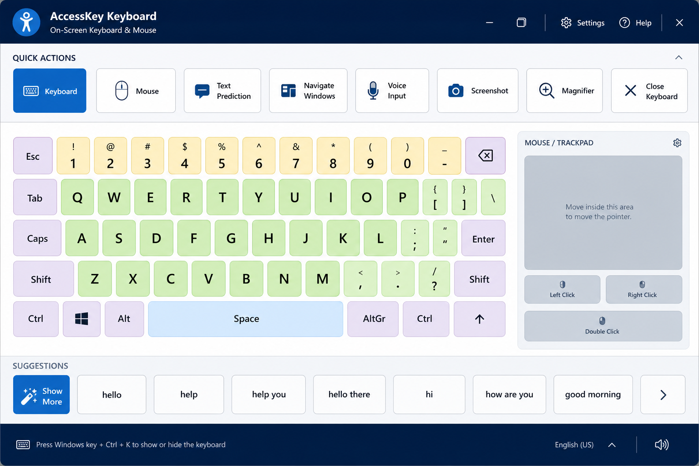
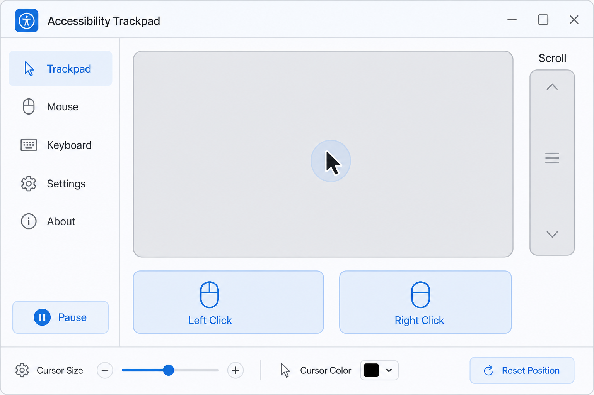
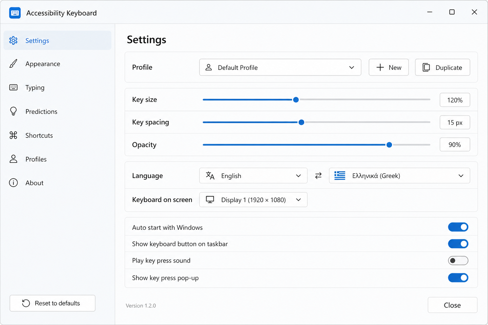

# Accessibility Keyboard

Assistive virtual keyboard and mouse for Windows — built for users with severe motor disabilities who operate a wheelchair-mounted touchscreen while applications run on a laptop display.

[](LICENSE)
[]()
[](https://github.com/pountzas/accessibility-keyboard/actions/workflows/build.yml)

Built with Tauri, React, Rust, and SQLite.

## Download (Windows)

Pre-built installers are on the [Releases](https://github.com/pountzas/accessibility-keyboard/releases) page.

1. Download the latest `.msi` or `.exe` installer for Windows.
2. Run the installer. On older Windows builds, you may need the [WebView2 runtime](https://developer.microsoft.com/en-us/microsoft-edge/webview2/).
3. Open the app on your accessibility monitor (wheelchair-mounted touchscreen), select a profile in Settings, and position the window on the correct display.

> **macOS builds are experimental.** CI produces `.dmg` bundles, but input injection and TTS still require Windows APIs for full functionality. See [Roadmap](#roadmap).

## Screenshots

| Main layout | Virtual trackpad | Settings |
|-------------|------------------|----------|
|  |  |  |

_Replace with captures from your release build when ready — see [docs/images/README.md](docs/images/README.md)._

## Features

### Keyboard

- System-wide keyboard injection with sticky modifiers
- Adjustable on-screen keyboard (size, spacing, colors, opacity)
- Optional function keys row (F1–F12) via Settings
- Keyboard / synthesizer mode toggle with two-octave piano keyboard
- Language switch key with country flag icons (EN ↔ EL)
- Predictive text (English + Greek) with disable toggle
- Macro builder with JSON import/export

### Mouse

- Virtual trackpad with left/right/floating placement
- Move, click, scroll from the accessibility touchscreen
- Toggle between trackpad and on-screen numeric keypad

### Communication

- Quick Actions bar (launch apps and URLs)
- Communication phrases with TTS (Windows SAPI)
- Emergency phrase section with show/hide toggle

### Profiles & accessibility

- Profiles (Child, Parent, Therapist)
- Multi-monitor detection and positioning
- Head tracking calibration wizard (webcam-based)
- English and Greek UI

## Requirements

**Full assistive functionality: Windows 10 or 11.**

macOS builds run the UI for development and testing; system-wide keyboard, mouse, and speech features are not yet implemented on macOS.

For development:

- Node.js 18+
- Rust (via [rustup](https://rustup.rs/))
- Visual Studio Build Tools with the C++ workload

## Development

```bash
npm install
npm run tauri dev
```

For Rust builds on Windows, ensure the MSVC environment is active. If `link.exe` is not found, run from a Developer Command Prompt or use:

```bat
"C:\Program Files (x86)\Microsoft Visual Studio\2022\BuildTools\VC\Auxiliary\Build\vcvars64.bat"
```

## Build from source

```bash
npm run tauri build
```

Installers and executables are written to:

```
src-tauri/target/release/bundle/
```

## Releases

Windows and macOS bundles are built in CI. Windows installers are published automatically when a [release-please](https://github.com/googleapis/release-please) Release PR is merged on `main`. Development happens on `dev`; merging `dev` → `main` opens the Release PR. See [CONTRIBUTING.md](CONTRIBUTING.md) for the full branch and versioning workflow.

## Architecture

| Path | Responsibility |
|------|----------------|
| `src/` | React frontend (keyboard, mouse, phrases, settings, head tracking) |
| `src-tauri/src/input/` | Platform keyboard/mouse injection (Windows `SendInput`; macOS stubs) |
| `src-tauri/src/window/` | Monitor enumeration (Windows APIs; macOS stub) |
| `src-tauri/src/tts/` | Text-to-speech (Windows SAPI / WinRT; macOS stub) |
| `src-tauri/src/db/` | SQLite persistence (profiles, phrases, macros) |
| `src-tauri/src/prediction/` | Predictive text suggestions |
| `docs/accessibility-requirements.md` | Personas and acceptance criteria |

## Roadmap

- Eye tracking support
- AutoHotkey macro import
- macOS port: CGEvent input, AVSpeechSynthesizer, native monitor APIs (experimental CI builds in progress)

## Known limitations

- Input injection does not work into elevated (admin) applications or UAC prompts
- macOS bundles lack system-wide input and TTS until the native backends land

## Contributing

Contributions are welcome. See [CONTRIBUTING.md](CONTRIBUTING.md) and [docs/accessibility-requirements.md](docs/accessibility-requirements.md) before opening a pull request.

Please read our [Code of Conduct](CODE_OF_CONDUCT.md).

## Security

To report a security vulnerability, see [SECURITY.md](SECURITY.md).

## License

MIT — see [LICENSE](LICENSE).

## Disclaimer

This is assistive software, not a medical device. Test thoroughly with your own hardware and accessibility setup before relying on it in daily use.
